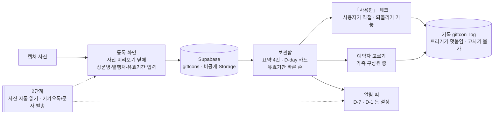

# 가족 기프티콘 관리 — 프로젝트 기획서

| 항목 | 내용 |
|---|---|
| 리포 | data09-21 |
| 제출자 | 김영현 |
| 직무·소속 | 소음진동 해석 담당 (data09-04 와 같은 수강생의 두 번째 과제). 이 과제는 업무 밖 생활 편의 주제입니다 |
| 과정 | 현장 데이터 디지털화 전문가과정 1차수 |
| 작성일 | 2026-09-29 |
| 문서 상태 | 초안 v0.1 — 패들릿 제출 원문 기반, 1단계 범위는 강사 방향(간결하게 · 사용 여부는 사용자가 직접 · 실제 DB · 한눈에 보이게)에 맞춤 |

이 문서는 제출자가 패들릿 「프로젝트 접수」에 올린 글(2026-09-29 12:08, `docs/source/패들릿_제출_원문.md`)을 과정 기획서 형식(10장)으로 정리한 것입니다. 5장 표에 요청 하나하나를 1단계·2단계로 나누고 이유를 적었습니다.

## 1. 추진 배경과 현안

- 가족이 각자 받은 기프티콘(모바일 교환권)이 **여러 사람의 휴대폰 사진첩·메신저에 흩어져** 있어, 무엇이 남았는지 한 번에 알기 어렵습니다.
- 유효기간을 놓쳐 **쓰지 못하고 만료**되거나, 이미 쓴 것을 다른 가족이 다시 쓰려는 일이 생깁니다.
- 제출자가 원하는 것: 가족이 **함께 등록·관리**하고, **사용 여부·유효기간을 알아보기 쉽게** 표시하고, **만료 전에 알림**을 받고, **누가 쓸지 예약**하고, **등록·사용 기록을 남기는 것**.

## 2. 목표

### 2.1 최종 목표 (제출 원문)

- 캡처 사진으로 기프티콘을 등록하면 내용·유효기간을 읽어 표시
- 발행처에서 사용 여부를 (가능하면) 자동 확인, 안 되면 수동
- 설정한 일정(1주 전·1일 전 등)에 가족에게 카카오톡·문자 알림
- 가족 중에서 사용 예약, 등록·사용 기록 저장

### 2.2 1단계 목표 (이 리포) — 강사 방향

**「간결하게」.** 가족이 휴대폰으로 열어 **무엇이 남았고 언제까지인지 한눈에** 보고, **「사용함」을 직접 체크**하는 보관함을 **실제 DB(Supabase)** 로 만듭니다.

- 사용 여부는 **사용자가 직접 표시**합니다. 발행처 자동 조회는 하지 않습니다(강사 결정, 8장 이유).
- 가족이 함께 보므로 브라우저 저장(localStorage)만으로는 부족합니다 → **수강생 본인 Supabase 프로젝트**에 로그인·가족·기프티콘·사진·기록을 둡니다.
- DB 를 아직 만들지 않은 사람도 바로 볼 수 있게 **체험 모드**(예시 데이터, 이 브라우저에만 저장)를 둡니다. 두 모드는 같은 화면을 씁니다.

## 3. 보유 데이터

| 데이터 | 형태 | 규모·주기 | 비고 |
|---|---|---|---|
| 기프티콘 캡처 사진 | 휴대폰 화면 캡처(JPG·PNG) | 가족 합계 수~수십 장, 수시로 늘어남 | 상품명·발행처·유효기간·바코드가 들어 있음. **바코드는 실제 결제 수단이라 공개 리포에 올리지 않습니다** |

제출 자료에 실제 캡처는 없습니다. 체험 모드에는 SVG 로 그린 **가짜 예시 그림**(가상 상호·가짜 바코드)을 씁니다.

## 4. 해결 방안 개요

| 단계 | 내용 |
|---|---|
| 수집 | 가족 각자 캡처 사진을 올리고, 사진을 보며 상품명·유효기간을 적음 |
| 정리 | 가족 단위로 DB 에 저장, 사진은 가족 폴더의 비공개 Storage |
| 분석 | 오늘 기준 남은 날(D-day)로 상태 판정: 사용 가능 · 7일 이내 만료 · 사용함 · 만료 |
| 산출물 | 한눈에 보는 보관함, 알림 목록, 등록·사용 기록 |

## 5. 주요 기능 — 요청별 1단계 / 2단계

| 제출 원문 요청 | 단계 | 1단계에서 한 것 / 미룬 이유 |
|---|---|---|
| 가족이 같이 등록·관리(등록·삭제 등) | **1단계** | 이메일 로그인 → 한 사람이 가족을 만들고 초대 코드 8자리를 알려 주면 나머지가 들어옴. 같은 가족만 보고 등록·고치기·삭제(RLS) |
| 캡처 사진으로 등록 | **1단계** | 사진 올리기(긴 변 1280px JPEG 로 줄임) + 비공개 Storage, 카드 썸네일을 누르면 크게 |
| 사진에서 내용·유효기간을 읽어 표시 | **2단계** | 1단계는 사진 미리보기 옆에 사람이 적음. 자동 읽기는 OCR/AI 호출이 필요해 키·비용·오인식 확인 절차가 따라옴 — 간결하게 가기 위해 미룸 |
| 사용 여부 확인·표시 또는 삭제 | **1단계** | 카드마다 큰 「사용함」 체크. 누가·언제 표시했는지 DB 가 로그인한 사람으로 기록, 다시 누르면 사용취소. 삭제 가능 |
| 발행처에서 사용 여부 자동 확인 | **하지 않음** | 강사 결정. 발행처(카카오 선물하기·각 브랜드 등)는 사용 여부를 조회하는 공개 API 를 주지 않고, 바코드·계정 정보로 긁어오면 약관·보안 문제가 있음. 가족이 직접 체크하는 쪽이 간단하고 정확함 |
| 자동 확인 불가 시 수동 입력/삭제 | **1단계** | 위 「사용함」 체크·삭제가 곧 이 기능 |
| 설정한 일정에 알림 (1주 전·1일 전 …) | **1단계(앱 안)** | 알림 시점을 설정(기본 D-7·D-1, D-30·14·3·당일·직접 입력). 보관함 맨 위에 「알림 N건」 띠로 보여 줌 |
| 카카오톡·문자로 발송 | **2단계** | 발송하려면 유료 발송 대행(알림톡·SMS)과 **서버**(정해진 시각에 도는 Supabase Edge Function + 예약 실행)가 필요하고, 발송 키를 브라우저·공개 리포에 둘 수 없음. 알림톡은 채널·템플릿 심사도 필요 |
| 사용 예약 (등록된 사용자 중 선택) | **1단계** | 카드의 「예약자」 선택(가족 구성원만 — DB 외래키로 강제). 구성원이 가족에서 나가면 예약만 풀림 |
| 등록/사용 기록 저장 | **1단계** | 등록·수정·사용·사용취소·예약·삭제를 DB 트리거가 기록. 사용자에게는 읽기만 있고 고치기·지우기 정책이 없음 |
| (추가) 한눈에 보기 | **1단계** | 요약 4칸(사용 가능·7일 이내 만료·사용함·만료)이 곧 거르기 단추, 유효기간 빠른 순 카드, 큰 D-day 배지 + 글자 풀이(색만으로 구분하지 않음), 휴대폰 먼저 |

## 6. 기대 산출물

1. **가족 기프티콘 보관함(웹, 1단계)** — https://aebonlee.github.io/data09-21/ (체험 모드로 바로 보임)
2. **DB 스크립트** — `supabase/schema.sql`: 표 4개 · RLS · 가족 RPC 2개 · 트리거 2개 · Storage 버킷과 정책. 로컬 PostgreSQL 검증 하네스(`scripts/sqltest/`)
3. **설치 안내** — `supabase/README.md` (본인 Supabase 프로젝트 만들기 → 스키마 실행 → 앱 설정)
4. **순수 로직과 테스트** — 상태·D-day·요약·정렬·알림·검증·기록 규칙(`js/logic.js`, `test/logic.test.mjs`)

## 7. 기술 구성

| 과정 도구 | 이 프로젝트에서 쓰는 곳 |
|---|---|
| DAY1 암묵지 자산화·전략기획 | 「누가 무엇을 언제까지 쓸 수 있나」를 가족 공동 기록으로 |
| DAY2 코랩(Python)·바이브코딩 | 보관함 화면·로직 제작 — 이 프로젝트의 중심 |
| DAY3 멀티모달 비정형 정보화 | (2단계) 캡처 사진에서 상품명·유효기간 읽기 |
| DAY4 RAG | 해당 없음 |
| DAY5 Make 자동화 | (2단계 대안) 정해진 시각에 DB 를 읽어 메시지 보내기 |

**개발 형태(1단계)**

- 설치 없이 도는 **정적 웹**(HTML·CSS·일반 스크립트). `index.html` 을 더블클릭해도 열립니다.
- DB 는 **수강생 본인 Supabase 프로젝트**(무료 등급으로 충분). 주소·anon 키는 앱 「설정」에 붙여 넣으면 그 브라우저에만 저장되고, **리포에는 어떤 키도 없습니다.**
- Supabase 라이브러리는 `vendor/supabase.js`(supabase-js 2.117.2 UMD, MIT)로 함께 둡니다 — 외부 CDN 을 부르지 않습니다.
- 로그인은 Supabase **이메일·비밀번호**. 가족마다 계정을 하나씩 만듭니다.

## 8. 개발 단계

### 1단계 — 가족 공유 보관함 (완료, 2026-09-29)

- 체험 모드: 예시 가족 4명·기프티콘 8장(오늘 기준으로 곧 만료·여유·사용함·만료가 섞이게 생성), 「지금 쓰는 사람」 바꾸기로 기록 모습 확인
- DB 모드: 로그인 → 가족 만들기/초대 코드로 들어가기 → 보관함
- 보관함·등록/고치기·기록·가족·설정(알림 시점·DB 연결) 화면

**하지 않기로 한 것 — 발행처 사용 여부 자동 확인 (강사 결정)**

- 발행처가 사용 여부를 외부에 알려 주는 공개 API 가 없습니다. 바코드 번호나 계정으로 발행처 화면을 긁어오는 방식은 약관 위반·계정 보안 위험이 있고, 화면이 바뀌면 멈춥니다.
- 기프티콘은 가족이 **매장에서 직접 쓰는 순간을 알고 있으므로**, 쓴 사람이 바로 「사용함」을 누르는 편이 간단하고 정확합니다.

### 2단계 — 알림 발송 · 사진 자동 읽기

- [ ] **카카오톡·문자 발송** — 발송 대행사 선택(알림톡은 카카오 채널·템플릿 심사, SMS 는 발신번호 등록), 건당 비용 확인
- [ ] 서버 쪽: Supabase Edge Function 이 하루 한 번(예약 실행) 알림 시점에 든 기프티콘을 찾아 가족에게 발송. 발송 키는 Edge Function 비밀값에만. 알림 시점 설정을 DB(가족별)로 옮기고 발송 기록 표 추가
- [ ] 받을 번호 동의·수신 거부 처리
- [ ] **사진 자동 읽기** — 캡처에서 상품명·발행처·유효기간을 읽어 칸을 미리 채우고 사람이 확인(반자동 프롬프트 방식 또는 OCR). 바코드 영역은 보내지 않도록 잘라내기 검토

### 3단계

- 금액형 상품권의 잔액 관리, 한 사람이 여러 가족(예: 부모님 댁)에 속하기, 휴대폰 홈 화면 앱(PWA)

## 9. 기대 효과

- **만료 손실 줄이기** — 곧 만료되는 것이 맨 위·알림 띠에 보여 놓치지 않습니다.
- **중복 사용·헛걸음 방지** — 누가 썼는지·누가 쓸 예정인지가 가족 모두에게 같게 보입니다.
- **기록으로 확인** — 「이거 누가 썼지?」를 기록 화면에서 바로 확인합니다.

제출 자료에 정량 목표가 없어 수치를 적지 않습니다.

## 10. 확인 필요 사항 (수강생께)

**로그인·가족**

1. 가족마다 **이메일·비밀번호로 가입**해도 괜찮으신가요? (부모님 등 이메일이 불편한 가족이 있으면 한 휴대폰을 같이 쓰는 방식 등 대안을 정해야 합니다)
2. 한 사람이 **여러 가족**(예: 우리 집 + 부모님 댁)에 속해야 하나요? 1단계는 한 사람 = 한 가족입니다.

**알림**

3. 알림 시점은 **D-7 · D-1** 기본값이면 될까요? 더 필요한 시점(D-30·D-3·당일 등)이 있으면 알려 주세요.
4. 2단계 발송은 **카카오톡(알림톡)과 문자 중 무엇**을 원하시나요? 둘 다 유료이고, 알림톡은 카카오 채널 개설·템플릿 심사가 필요합니다. 알림을 받을 사람은 **예약자만**인지 **가족 전체**인지도 정해 주세요.

**예약·사용**

5. 「예약」은 **「누가 쓸지 표시」** 로 충분한가요? 예약하면 다른 가족이 「사용함」을 못 누르게 막는 등 더 강한 규칙이 필요한가요? (1단계는 표시만 합니다)
6. **금액형 상품권**(1만원권을 여러 번 나눠 씀)이 많은가요? 1단계는 메모에 잔액을 적는 방식입니다.

**사진**

7. 사진에서 **상품명·유효기간 자동 읽기**가 꼭 필요한가요? 필요하면 2단계에서 AI 에 사진을 보내게 되는데, 바코드가 외부로 나가지 않게 하는 방법을 함께 정해야 합니다.

## 부록. 제출 원문 요약

| 출처 | 게시물 | 내용 |
|---|---|---|
| 패들릿 「프로젝트 접수」 (2026-09-29 12:08) | `docs/source/패들릿_제출_원문.md` | 현안: 가족 공용 기프티콘 관리·미사용 알람. 보유 데이터: 캡처 사진. 기대 산출물: 가족 등록·관리 사이트, 사진으로 내용·유효기간 표시, 사용 여부 확인(가능 시 자동, 아니면 수동), 일정별 카카오톡·문자 알림, 가족 중 사용 예약, 등록·사용 기록 |
